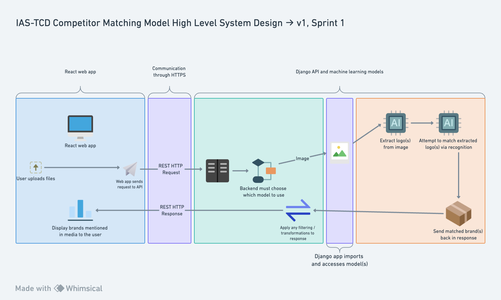

# System Design - Sprint 1

This sprint focuses on setting up the repositories, exploring existing solutions and getting an initial prototype set up.
The image below shows our initial system design and how each component interacts.

Our plan for sprint 1 is to start with images, in particular logo recognition.
The functionality we hope to have supported are the following:

- Allow the user to upload an image that may contain logos from any of the following brands:
  - Nike
  - Puma
  - Adidas
  - Under Armour
  - New balance
  - North face
  - Lululemon
  - Reebok
- The image will be run through a logo extraction model to find any logos in the image.
- The resultant logo(s) will be passed through a logo recognition model to see if they match any of the above brands.
- The matches will be returned to the user for them to see
- Communication with the back end and models will be done through a REST API

Each of the three large sections in the above image (blue, green, orange) represent the larger components of the project - the web app, the API and the models respectively.
The first purple sections show how each component communicates.
There is no direct access from the web app to the models, this must be done through the API.
The front end and the API communicate via HTTP(S) requests.
The API and the models are in the same repository so the models' functions can be called directly in the API by simple imports.
